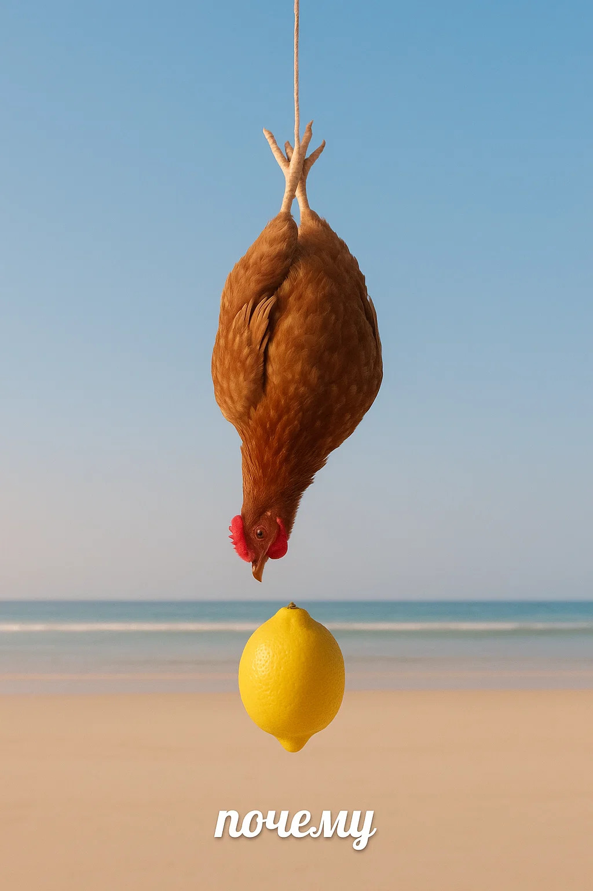

  

### Frontend:

  
  
  
  
  
  
  
  
  
  
  

### Backend:

  
  
  

### Database:

  
  

### Other skills:

  
  
  
  

#### Change my mind

<table>
  <tr>
    <td style="vertical-align: middle;"></td>
    <td style="vertical-align: middle;">
Better than
</td>
    <td style="vertical-align: middle;"></td>
  </tr>
</table>
